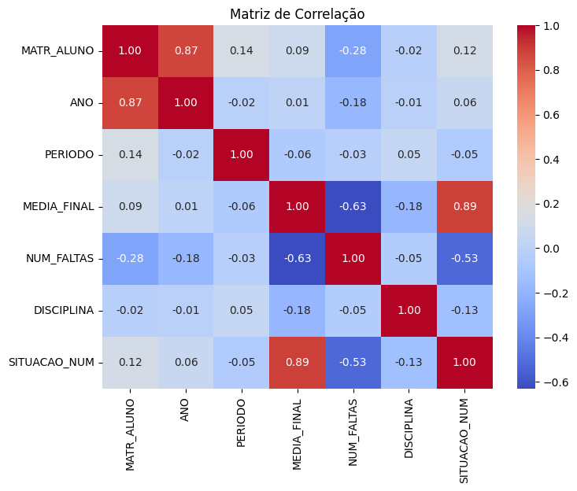
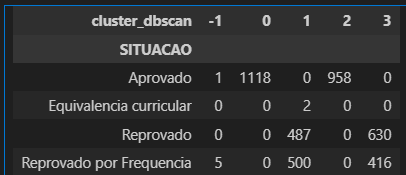
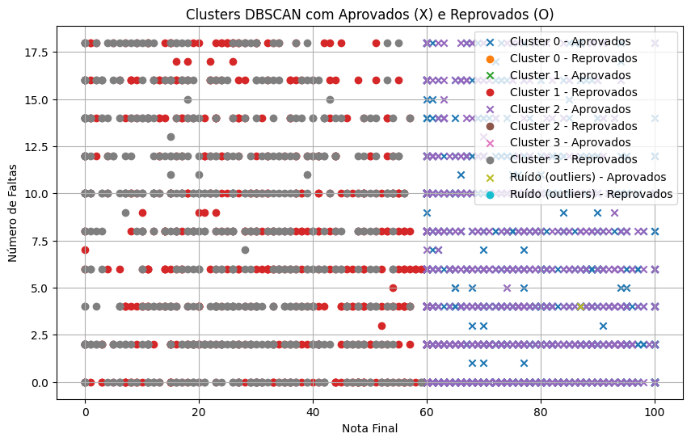

# Ao Iniciar o Projeto, instalar o requirement.txt para habilitar todas as bibliotecas utilizadas em sua devida versão.

pip install requirements.txt

# Depois, por favor, coloque os seguintes arquivos na pasta raiz

Reconhecimento-de-Padroes\Código_do_País_de_Nascimento_ou_Naturalização.xlsx  
Reconhecimento-de-Padroes\dados_disciplinas.txt  
Reconhecimento-de-Padroes\Dicionário de Variáveis.xls  
Reconhecimento-de-Padroes\DM_ALUNO.CSV  
Reconhecimento-de-Padroes\DM_DOCENTE.CSV  

# Agora, mão na massa!

Primeiramente verificamos se haviam dados nulos na base, que poderiam prejudicar. Fizemos uma correlação e avaliamos se habia dados que não faziam sentido, encontramos notas de alunos com valores iguais a -1. Removemos esses dados e refizemos a correlação, melhorando a acuracidade do modelo, que passaria a desconsiderar esses dados. Os alunos com nota -1 haviam feito equivalencia ou teriam sido dispensados. 

Rodando o DBScan notammos que os clustes 0 e 2 são de alunos aprovados, os demais, reprovados. Há uma grande correlação entre alunos faltantes e reprovações. Há relação fraca entre a matricula do aluno e numero de faltas e também o ano de ingresso e numero de faltas.

Por fim, separando os clusteres, podemos redesenhar nossas variaveis de quantidade de falta vs media de aprovação.

Elementos que aparecem com X são aprovados e com O são reprovados. Os clusteres foram separados por cores. Sendo azul e roxo os aprovados, respectivamente cluster 0 e 2, já os de cores vermelha e cinza, os clusteres 1 e 3. Demais cores foram detectadas como outliers da nossa base (6 elementos de 4597).